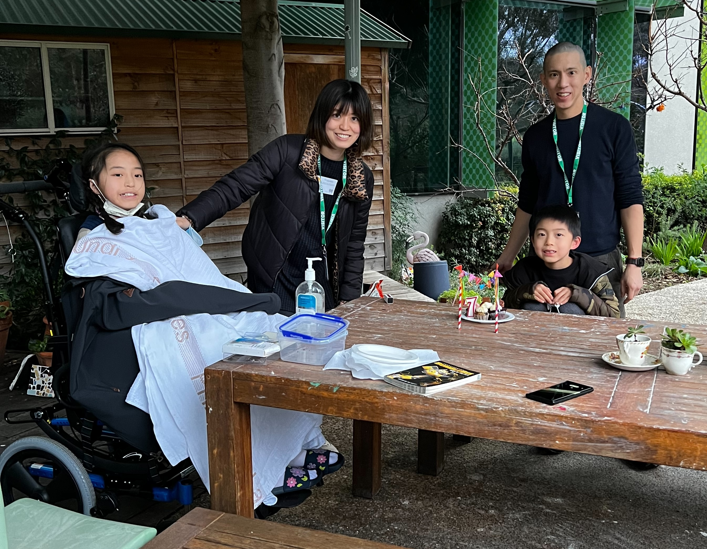
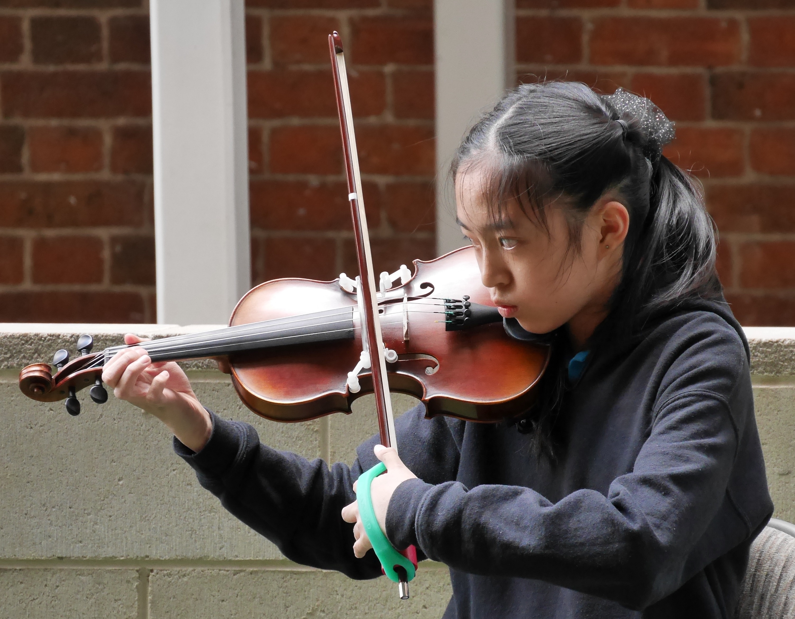

**Please note: This story is a work in progress. I will announce when it is complete.**

[Thingiverse profile](https://www.thingiverse.com/vekp)

## Tiana's stroke

<figure>
    
    <figcaption>Our family, celebrating Tiana's 10th birthday in early 2022. Clockwise from top: Vincent, Roland, Tiana, Sayaka.</figcaption>
</figure>

On June 6, 2022, our daughter Tiana, 10 years old at the time, suffered a severe stroke when an arteriovenous malformation (AVM) in her brain ruptured. She was hospitalised at the Royal Children's Hospital (RCH), and survived a complex 11-hour operation where her AVM was removed. Although the surgery was a huge success, the stroke had taken away all of Tiana's independence in an instant. The entire left side of her body was completely paralysed, leaving her unable to walk, sit, eat, drink, smile, or even turn her head. 

<figure>
    
    <figcaption>Tiana recovering in PICU after major brain surgery.</figcaption>
</figure>

We had been aware of Tiana's AVM since 2 years prior, and had known that there was a small chance that it could rupture. However, there are many people who live their whole lives with unruptured AVMs - some may never even be aware that they have them - and we had hoped that Tiana would be lucky enough to be one of them. We were terrified of what it would mean if it did rupture, and spent many nights fearing the worst.

When it happened to Tiana, that fear had come true, all too soon. We were shocked and grieved for everything that she had lost. We worried for her future. Would she ever be able to live independently? How would society treat her? Would she ever be able to play her violin again? Perhaps most importantly, what would Tiana think of herself having a disability?

For 2.5 months, I stayed with her at RCH, through her recovery from surgery and the beginning of her rehabilitation. The incredible positivity of the staff there was overwhelming, and we eventually stopped grieving our losses and learnt how important it was to stay optimistic, celebrate all of Tiana's achievements, big and small, and just focus on hitting the next goal.

With the support of her therapists and Tiana's perseverance, she gradually began to regain movement in her left side. Almost every day, she amazed us with some new muscle movement. Best of all, we got to see her initially one-sided smile get bigger and better with each day that passed.

<figure>
    
    <figcaption>Tiana practising her smile.</figcaption>
</figure>

We celebrated Roland's 7th birthday a few weeks into our stay at RCH. With so much attention on Tiana and her recovery, we had been unable to give him much attention, and he had been spending a lot of time under the care of our extended family. Strict COVID policy made it difficult for us to bring him into the ward, but we were granted an exemption for his birthday. It was so nice for all of us to be together again to celebrate.

<figure>
    
    <figcaption>Roland's 7th birthday and Tiana's first time outside since the stroke.</figcaption>
</figure>

I had my first experience with 3D printing at RCH. I occasionally visited the Spiritual Care centre, where I met Paul, the coordinator. Paul is a 3D printing enthusiast, and his office was decorated with an assortment of sensory toys, lithophanes of his family and other items that he had 3D printed himself. When I introduced Tiana to him, he kindly gave her an articulating crystal dragon. I couldn’t figure out how it had been assembled, until Paul explained how the nature of additive 3D printing in layers from the bottom up allows for the creation of permanently interlocked pieces - something difficult to achieve using traditional manufacturing methods. I was intrigued by the possibilities.

<figure>
    
    <figcaption>3D printed articulated Crystal Dragon, gifted to Tiana during her stay at RCH</figcaption>
</figure>

Music has always been important to Tiana. My mother-in-law is a piano teacher, and has been teaching Tiana online from Japan for years. Tiana had also been playing violin since grade 2 with her violin teacher Hilary. We were fortunate to be involved in the music therapy program at RCH, and Tiana always looked forward to her twice-weekly sessions. Her music therapist Jo even allowed us to borrow a keyboard so Tiana could play anytime in her room. Although I had to help by playing the left hand parts for her, it meant so much for her to be able to continue with it during her stay.

<figure>
    
    <figcaption>Jamming during a music therapy session</figcaption>
</figure>

The music therapy room was full of instruments for us to try, including a banana keyboard. Having such a variety of instruments available was great in getting Tiana to start using her left hand again to create music.

<figure class="center">
    <iframe width="400" height="300" src="https://www.youtube.com/embed/N46noUIJXD8" title="Tiana leaving the Royal Children's Hospital after spending 2.5 months recovering from a stroke" frameborder="0" allow="accelerometer; autoplay; clipboard-write; encrypted-media; gyroscope; picture-in-picture; web-share" referrerpolicy="strict-origin-when-cross-origin" allowfullscreen></iframe>
    <figcaption>Tiana walks out of Kelpie Ward at the end of her 2.5 month stay.</figcaption>
</figure>

We took every opportunity we could for Tiana to practise walking, and our rehab doctor soon took notice of her amazing progress and moved up her discharge date by two weeks. When the day finally arrived, watching her walk out of the ward to the cheers of her therapy team and the ward staff was one of our proudest moments.

Although it had only taken a couple of months for Tiana to walk again and begin regaining her independence, it is often much harder to recover movement in the fingers of the affected side following a stroke. So we had no idea whether she would ever be able to play or even hold the violin again, with the amount of strength and dexterity required in the fingers of the left hand. 

## A career change

Shortly after discharge, as Tiana made her gradual return to school, I had a big decision to make. My workplace was undergoing a restructure at the time, and everyone in my department had been offered the chance to volunteer for a redundancy. We had all been given years of notice, and initially I had planned to turn down the offer and stay. With Tiana's stroke, I began to rethink my decision.

Tiana still needed a significant amount of support at home, as well as help with her regular occupational and physiotherapy sessions to ensure that she would recover as much movement as possible early on. It just wouldn't be possible for me to return to work full time in the foreseeable future. So I made the decision to volunteer to take a redundancy, and spend my time studying online for my future career and supporting my family.

I had always enjoyed finding ways to use technology, both at work and at home, to improve the way things are done. Inspired by the support we had received over the months and watching Tiana's perseverance in rebuilding herself, I decided to study information technology, working towards a career where I could use my skills and experience to help people in need like Tiana to improve their lives and achieve their goals.

After testing the waters with Harvard University's free online courses [CS50X](https://cs50.harvard.edu/x/) and [CS50P](https://cs50.harvard.edu/python/), I enrolled in a [Graduate Diploma in Information Technology](https://www.une.edu.au/study/courses/graduate-diploma-in-information-technology) at the University of New England.

## Violin

While scrolling through Facebook, I was lucky to learn of the Adaptive Music Bridging Program (AMBP) run by Dr Anthea Skinner, a collaborative research project of the University of Melbourne and Melbourne Youth Orchestras. Tiana was accepted into the program, which kicked off with a Come & Try Day in early 2023. 

Tiana had the chance to try a range instruments, from a glockenspiel to a euphonium, selected as they could be played one-handed. Although she had a great time trying them out, her own violin was the only ensemble instrument that she wanted to play. So, we decided that day to get the strings and bridge on her violin reversed so she could use her unaffected right hand for fingering, while using her weaker left hand for bowing. We knew that it wouldn't be easy for her to control the angle, direction, speed and pressure of the bow, but we knew that if she had the will to do it, she could make it happen. We organised to get the string and bridge reversal done and then planned another session to figure out any other modifications we might need.

## Setbacks

Just days before that session, Tiana took a fall down a flight of steps. She ended up with a fracture in her upper left arm, a large bump on her forehead, and bruises all over her body. With Tiana's left side weakness, she has an increased risk of falls, and when it does happen, she is not able to react as well as normal to protect herself from serious injury. We were lucky that the fracture was the worst of her injuries, but with her arm immobilised for a month, it was a huge blow to her plans to resume playing violin.

Her arm recovered well, and when the wait was finally over, we finally had that session where we put together the rest of her violin modifications. A red piece of foam tubing became her bow grip, combined with a green silicone EazyHold strap that went over the back of her hand, allowed her to keep hold of her bow. A pencil, which we later swapped with a chopstick for a cleaner look, was attached to her violin to help keep the bow in the correct position by supporting some of its weight.

Even with these modifications, the reversed violin was now a completely different instrument to what she'd played before her stroke. She needed to learn everything from scratch. In addition, Tiana's affected arm would tire immediately, and she would have to rest after playing for less than a minute. We were also unable to find a reversed chin rest and shoulder rest to suit her 1/2 size violin, so we had to make do with the least uncomfortable ones we could find. Despite the discomfort caused by ill-fitting equipment, she resumed lessons with her long-time violin teacher Hilary, commenced ensemble sessions with the AMBP, and kept practising at home, gradually building her strength and skill over the months until she could keep up with the rest of her group at the AMBP.

## A need for 3D printing

When we signed Tiana up for the program, we had no idea what to expect. Even with the help of the program, we had feared that Tiana would find it too hard and give up at some point. Tiana surprised all of us with how quickly she was progressing, but we knew that her equipment was holding her back. There just wasn't anything on the market that could give her what she needed.

I had joined a paediatric stroke survivor support group called Little Stroke Warriors (LSW). To celebrate Tiana's stroke anniversary, we posted the story of her stroke and progress with the AMBP in a fundraiser for RCH, and I shared it with the group. Another LSW parent, Anh, soon reached out to me, asking about the string and bridge reversal that we had done. Her daughter Tammy also suffered from left-side weakness, and they were planning for her to start learning to play a reversed cello.

Anh is an engineer, and she suggested that I 3D scan and 3D print a reversed chin rest for Tiana's violin. I considered it, but I was unsure of where to go, or what sort of costs it would involve. How much would I need to spend on equipment, and how much time would I need to spending learning how to do it? I hesitated, until Anh made a post herself, sharing photos of a cello bow handle with adjustable angles that she had designed and printed herself. Inspired, I started looking into 3D printing options, and I was surprised to discover that the [City of Melbourne Library makerspaces](https://www.melbourne.vic.gov.au/community/libraries/makerspaces/Pages/makerspaces.aspx) that had all the equipment I would need, and it was all free to use.

In October 2023, I booked myself in for a safety induction at [Kathleen Syme Library and Community Centre](https://www.melbourne.vic.gov.au/community/hubs-bookable-spaces/kathleen-syme-library-and-community-centre/Pages/kathleen-syme-library.aspx), and with the help of the makerspace staff, I had soon 3D scanned a chin rest, mirrored it in a slicer, and had my very first 3D print going.

## Chin rest - to allow Tiana to play comfortably

<figure>
    
    
    <figcaption>My first 3D print.</figcaption>
</figure>

To minimise the amount of support material, I had printed the chin rest with the top surface, the one that would be in contact with Tiana's skin, facing down. I had not realised that after removing supports, there would be such a rough surface on the bottom. So, I spent several hours trying to sand down the surface to make it comfortable to use. I got it to the point where I didn't think it would cut into her skin, but it was still extremely rough and I was somewhat disappointed with the result. 

Then, since the 3D scanner had not been able to pick up the holes for the mounting hardware, I had to drill some holes into it. I had assumed it would be as simple as drilling into wood, but soon realised that I was mistaken. Polylactic acid (PLA), the material most commonly used in 3D printing, is very hard and resistant to drilling. The heat generated from drilling can also melt the plastic, causing it to stick to the drill bit. I eventually managed to drill two small holes for the mounting screws, but it took so much longer than I had expected.

<figure>
    
    <figcaption>The chin rest finally installed on the violin.</figcaption>
</figure>

After spending most of the day post-processing my first prototype, I was finally able to attach it to Tiana's violin, just in time to pick her up from school and take her to her violin lesson with Hilary. I mentioned the roughness of the surface, and Hilary suggested that she could cover it with a cloth facemask. It worked! . I planned to repeat the process and create several different styles for her to try, so she could find the she would be most comfortable with.

Lessons learned:
* Orient surfaces as close to vertical as possible to give them a smooth finish. 
* If you need holes, include them in the design of the model before printing. 

I ended up learning to use [Tinkercad](https://www.tinkercad.com/) so I could add holes to the chin rest before printing. I also took the opportunity to add Tiana's engraved name to the design. After scanning and printing several different chin rests, I was finally able to create one that was comfortable for Tiana to use, and looked nice enough for her to perform with.

## Bow guide - to allow Tiana to setup independently

The chopstick and rubber bands had been working great to help Tiana keep her bow in position. They had to be installed and removed each time Tiana played the violin, since they wouldn't fit as fitted in the case. Rubber bands would often fly off during the process, and it was impossible to install without using two hands. Tiana needed someone else to do it for her each time.

Anthea from the AMBP had kindly given us a Horace bow guide to try. It has two parallel rails, forcing violinists to keep their bow perfectly straight, perpendicular to the strings. This was something that was too difficult at the time for Tiana with her affected wrist. Tiana just needed something to help support the weight of the bow and stop it from sliding down towards the neck. Getting the perfect angle was not important just yet. So we had kept the bow guide aside, and had been using the chopstick instead.

With access to the equipment in the makerspace, I thought that I could remove one rail from the bow guide so that it would allow for some imprecision but still support the bow's weight. One of the feet ended up getting in the way of her bow, so I cut that one off, and designed and printed a small peg to insert into the f-hole to help hold the bow guide in place.

It seemed to work well, until disaster struck at the worst possible moment. Tiana had just finished speaking in front of hundreds of students, parents and teachers at school assembly, having just announced the final tally of a Stroke Foundation fundraiser that she taken part in. She was about to follow this up with her first violin performance since suffering her stroke. 

<figure>
    
    <figcaption>Tiana plays violin in her first post-stroke performance at school assembly, December 2023.</figcaption>
</figure>

Just as she was getting ready to play the first note, the bow guide fell off her violin onto the ground. Nervous as she already was, she picked it up and set it up again with the whole school watching. It shook her up, but she bravely soldiered on and managed to get through to the end of the song. But it wasn't quite the comeback performance she'd hoped for, and she was disappointed with how it went, understandably reluctant to perform in front of people ever again.

I couldn't help feeling responsible for what had happened. Something I had designed for her had failed when she needed it the most. It was clear that I had not put enough thought into designing it. It wasn't fair on her. No other violinist needs to worry about pieces of their instrument randomly falling off when they're performing, nor should they. Would my failure lead to her developing a fear of performing? Would she be able to get onto the stage again?

With two more upcoming concerts in the following weeks, Tiana kept practising every day, and I think her confidence in her own skill grew to the point where she was able to overcome any mistrust she might have had in her equipment. At a small concert with Hilary's group of violin students, and a larger one with AMBP, Tiana's performances went great, and fortunately without any repeat incidents. But I 