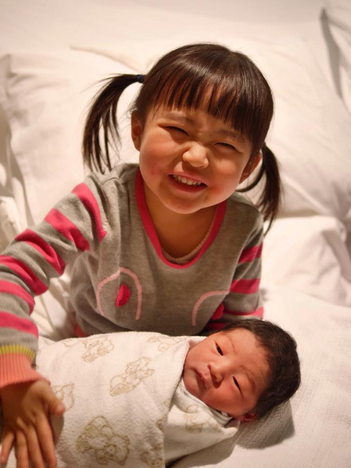
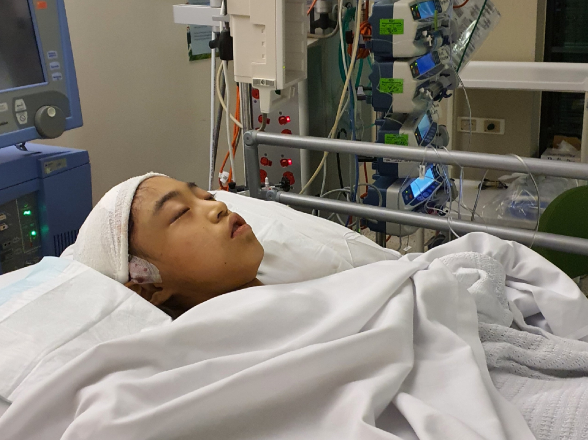

**Please note: This story is a work in progress and subject to change. I will announce when it is complete.**

[Thingiverse profile](https://www.thingiverse.com/vekp)

### Table of contents
{:.no_toc}

* TOC
{:toc}

# Our family's story 
*Vincent Ekpanyaskun, July 2024*

I am sharing my family's story in the hope that it will inspire those facing setbacks and challenges, educate them about the potential of maker technologies like 3D printing, and encourage them to seek out the support they need to learn new skills that can empower them to overcome their challenges, improve their lives, and achieve their goals.

This is the story of my daughter Tiana, who suffered a debilitating stroke at age 10 but refused to let it diminish her passion for music. As a complete beginner, I learned how to use 3D modelling and printing to create adaptive tools that have enabled her to play her violin comfortably and independently once again.

If that sounds like an expensive hobby to take up, please read on to learn how I used free web applications for design and accessed 3D printers at public library makerspaces, investing only my own time to learn how to make it happen.

## Early days

Tiana's medical journey started from before she was born. An antenatal ultrasound had revealed a lymphangioma in Tiana's neck and chest which had the potential to causes breathing issues. To our relief, the lymphangioma did not give her any trouble then, and still hasn't. It is still there, and is unlikely to cause any problems in the future. It did, however, set off a series of medical imaging procedures on newborn Tiana, in which the results of an MRI raised alarms.

The scan had identified an arteriovenous fistula (AVF) in Tiana's brain that threatened to haemorrhage, which could cause a stroke or death. She was placed under the care of neurosurgeon Dr Alison Wray at RCH. Dr Wray planned to wait until Tiana was 5 months old, then ligate the AVF surgically. She assured us that it was a relatively simple procedure, and after Googling her name and reading about some of her amazing work, we agreed to the operation. As terrifying as it was for us to put our tiny, precious daughter's life in the hands of someone else, we knew that she would be in the best of hands, in a brand new, world-class facility.

<figure>
    
    <figcaption>Tiana recovering at RCH after first major brain surgery.</figcaption>
</figure>

As we had hoped, the operation was a success, and after spending just a few days recovering in Cockatoo Ward, Tiana was back to her normal self at home.  

<figure>
    
    <figcaption>Tiana back at home.</figcaption>
</figure>

She had an impressive new scar that would eventually be mostly hidden by her hair, and she needed regular ongoing MRIs to monitor the blood vessels in her head, but otherwise led a pretty normal life, unaffected by and mostly unaware of the all the dramas that had occurred.

<figure>
    
    <figcaption>3 year old Tiana welcoming newborn brother Roland to the world.</figcaption>
</figure>

Music has always been important to Tiana. My mother-in-law is a piano teacher, and has been teaching Tiana online from Japan for many years. Tiana has also been learning to play violin since grade 2 with her violin teacher Hilary.

<figure class="center">
    <iframe width="400" height="225" src="https://www.youtube.com/embed/DS4W9yg_QD0" title="YouTube video player" frameborder="0" allow="accelerometer; autoplay; clipboard-write; encrypted-media; gyroscope; picture-in-picture; web-share" referrerpolicy="strict-origin-when-cross-origin" allowfullscreen></iframe>
    <figcaption>Tiana, at age 6, performing at her first piano concert.</figcaption>
</figure>

In 2020, we received some shocking news. The routine MRIs had picked up an arteriovenous malformation (AVM) close to where her AVF had been. We learned that there was a small chance each year that it could rupture, causing a stroke. However, there are many people who live their whole lives with unruptured AVMs - some never even aware of their existence - and we hoped that Tiana would be lucky enough to be one of them. 

Due to the complexity and location of the malformation, pre-emptive surgical removal would be unacceptably risky, so it was decided that we would not treat it then, but continue to monitor it closely for any changes. We were terrified of what it would mean if it did rupture, and spent the next two years fearing the worst.

<figure>
    
    <figcaption>Our family, celebrating Tiana's 10th birthday in early 2022. Clockwise from top: Vincent, Roland, Tiana, Sayaka.</figcaption>
</figure>

## RCH

On June 6, 2022, Tiana, 10 years old at the time, those fears were finally realised. She was hospitalised at the Royal Children's Hospital (RCH), and survived a complex 11-hour operation in which her AVM was removed. Although the surgery was a huge success, the stroke had taken away all of Tiana's independence in an instant. The entire left side of her body was completely paralysed, leaving her unable to walk, sit, eat, drink, smile, or even turn her head. 

<figure>
    
    <figcaption>Tiana recovering in PICU after major brain surgery.</figcaption>
</figure>

We were shocked and grieved for everything that she had lost. We worried for her future. Would she ever be able to live independently? How would society treat her? Would she ever be able to play her violin again? Perhaps most importantly, what would Tiana think of herself having a disability?

For 2.5 months, I stayed with her at RCH, through her recovery from surgery and the beginning of her rehabilitation. For many days, I would find myself awake at 4am, crying. When the tears stopped, I would walk down the darkened corridors of Kelpie Ward to the kitchen and make myself a cup of coffee. I would bring it back to our room and resume crying, hoping that the tears would stop before Tiana awoke. They usually didn't.

When I started talking to other parents in the ward, I began to realise that Tiana was not alone in her suffering. Kelpie Ward was shared between rehab patients like Tiana, cancer patients and mental health patients. Although everyone's experience was unique, there was a real sense of community and we all supported each other through our stays.

I would often read to Tiana in those early days. Initially we just read fiction as a way to escape our situation, but then I came across the [RCH patient stories](https://www.goodfridayappeal.com.au/stories/) on the Good Friday Appeal website, and we started reading them, finding out about the many amazing ways RCH had helped other kids. Sometimes we were saddened to read the stories about kids with degenerative diseases such as muscular dystrophy. We started realising how incredibly fortunate we were to be in such a facility as RCH. 

The incredible positivity of the staff there was overwhelming, and we eventually stopped grieving our losses and learnt how important it was to stay optimistic, celebrate all of Tiana's achievements, big and small, and just focus on hitting the next goal.

With the support of her therapists and Tiana's perseverance, she gradually began to regain movement in her left side. Almost every day, she amazed us with some new muscle movement. Best of all, we got to see her initially one-sided smile get bigger and better with each day that passed.

<figure>
    
    <figcaption>Tiana practising her smile.</figcaption>
</figure>

We celebrated Roland's 7th birthday a few weeks into our stay at RCH. With so much of our focus on Tiana and her recovery, we had been unable to give him much attention, and he had been spending a lot of time under the care of our extended family. Strict COVID policy made it difficult for us to bring him into the ward, but we were granted an exemption for his birthday. It was so nice for all of us to be together again to celebrate.

<figure>
    
    <figcaption>Roland's 7th birthday and Tiana's first time outside since the stroke.</figcaption>
</figure>

You may have noticed my freshly shaved head in the photo. Tiana had to have a large portion of her hair removed for the surgery. Like any parent would, I wished for her suffering to have happened to me instead. Shaving my head was the only thing I way I could think of to share in her suffering without actually hurting myself. And it came with bonus giggles every time she looked at me over the following week or so. 

I had my first experience with 3D printing at RCH. I occasionally visited the Spiritual Care centre, where I met Paul, the coordinator. Paul is a 3D printing enthusiast, and his office was decorated with an assortment of sensory toys, lithophanes of his family and other items that he had 3D printed himself. When I introduced Tiana to him, he kindly gave her an articulating crystal dragon. I couldn’t figure out how it had been assembled, until Paul explained how the nature of additive 3D printing in layers from the bottom up allows for the creation of permanently interlocked pieces - something difficult to achieve using traditional manufacturing methods. I was intrigued by the possibilities.

<figure>
    
    <figcaption>3D printed articulated Crystal Dragon, gifted to Tiana during her stay at RCH</figcaption>
</figure>

We were fortunate to be involved in the music therapy program at RCH, and Tiana always looked forward to her twice-weekly sessions. Her music therapist Jo even allowed us to borrow a keyboard so Tiana could play anytime in her room. Although I had to help by playing the left hand parts for her, it meant so much for her to be able to continue with it during her stay.

<figure>
    
    <figcaption>Jamming during a music therapy session</figcaption>
</figure>

The music therapy room was full of instruments for us to try, including a banana keyboard. Having such a variety of instruments available was great in getting Tiana to start using her left hand again to create music.

<figure class="center">
    <iframe width="400" height="300" src="https://www.youtube.com/embed/N46noUIJXD8" title="Tiana leaving the Royal Children's Hospital after spending 2.5 months recovering from a stroke" frameborder="0" allow="accelerometer; autoplay; clipboard-write; encrypted-media; gyroscope; picture-in-picture; web-share" referrerpolicy="strict-origin-when-cross-origin" allowfullscreen></iframe>
    <figcaption>Tiana walks out of Kelpie Ward at the end of her 2.5 month stay.</figcaption>
</figure>

We took every opportunity we could for Tiana to practise walking, and our rehab doctor soon took notice of her amazing progress and brought her discharge date forward by two weeks. When the day finally arrived, watching her walk out of the ward to the cheers of her therapy team and the ward staff was one of our proudest moments.

Although it had only taken a couple of months for Tiana to walk again and begin regaining her independence, it is often much harder to recover movement in the fingers of the affected side following a stroke. So we had no idea whether she would ever be able to play or even hold the violin again, with the amount of strength and dexterity required in the fingers of the left hand. 

## Turning point

Shortly after discharge, as Tiana made her gradual return to school, I had a big decision to make. My workplace was undergoing a restructure at the time, and everyone in my department had been offered the chance to volunteer for a redundancy. We had all been given years of notice, and initially I had planned to turn down the offer and stay. With Tiana's stroke, I began to rethink my decision.

Tiana still needed a significant amount of support at home, as well as help with her regular occupational and physiotherapy sessions to ensure that she would recover as much movement as possible early on. It just wouldn't be possible for me to return to work full time in the foreseeable future. So I made the decision to volunteer to take a redundancy, and spend my time studying online for my future career and supporting my family.

I had always enjoyed finding ways to use technology, both at work and at home, to improve the way things are done. Inspired by the support we had received over the months and watching Tiana's perseverance in rebuilding herself, I decided to study information technology, working towards a career where I could use my skills and experience to help people in need like Tiana to improve their lives and achieve their goals.

After testing the waters with Harvard University's free online courses [CS50X](https://cs50.harvard.edu/x/) and [CS50P](https://cs50.harvard.edu/python/), I enrolled in a [Graduate Diploma in Information Technology](https://www.une.edu.au/study/courses/graduate-diploma-in-information-technology) at the University of New England.

## Violin

While scrolling through Facebook, I was lucky to learn of the Adaptive Music Bridging Program (AMBP) run by Dr Anthea Skinner, a collaborative research project of the University of Melbourne and Melbourne Youth Orchestras. Tiana was accepted into the program, which kicked off with a Come & Try Day in early 2023. 

Tiana had the chance to try a range instruments, from a glockenspiel to a euphonium, selected as they could be played one-handed. Although she had a great time trying them out, her own violin was the only ensemble instrument that she wanted to play. So, we decided that day to get the strings and bridge on her violin reversed so she could use her unaffected right hand for fingering, while using her weaker left hand for bowing. We knew that it wouldn't be easy for her to control the angle, direction, speed and pressure of the bow, but we knew that if she had the will to do it, she could make it happen. We organised to get the string and bridge reversal done and then planned another session to figure out any other modifications we might need.

## Setbacks

Just days before that session, Tiana took a fall down a flight of steps. She ended up with a fracture in her upper left arm, a large bump on her forehead, and bruises all over her body. With Tiana's left side weakness, she has an increased risk of falls, and when it does happen, she is not able to react as well as normal to protect herself from serious injury. We were lucky that the fracture was the worst of her injuries, but with her arm immobilised for a month, it was a huge blow to her plans to resume playing violin.

Her arm recovered well, and when the wait was finally over, we finally had that session where we put together the rest of her violin modifications. A red piece of foam tubing became her bow grip, combined with a green silicone EazyHold strap that went over the back of her hand, allowed her to keep hold of her bow. A pencil, which we later swapped with a chopstick for a cleaner look, was attached to her violin to help keep the bow in the correct position by supporting some of its weight.

Even with these modifications, the reversed violin was now a completely different instrument to what she'd played before her stroke. She needed to learn everything from scratch. In addition, Tiana's affected arm would tire immediately, and she would have to rest after playing for less than a minute. We were also unable to find a reversed chin rest and shoulder rest to suit her 1/2 size violin, so we had to make do with the least uncomfortable ones we could find. Despite the discomfort caused by ill-fitting equipment, she resumed lessons with her long-time violin teacher Hilary, commenced ensemble sessions with the AMBP, and kept practising at home, gradually building her strength and skill over the months until she could keep up with the rest of her group at the AMBP.

## A need for 3D printing

When we signed Tiana up for the program, we had no idea what to expect. Even with the help of the program, we had feared that Tiana would find it too hard and give up at some point. Tiana surprised all of us with how quickly she was progressing, but we knew that her equipment was holding her back. There just wasn't anything on the market that could give her what she needed.

I had joined a paediatric stroke survivor support group called Little Stroke Warriors (LSW). To celebrate Tiana's stroke anniversary, we posted the story of her stroke and progress with the AMBP in a fundraiser for RCH, and I shared it with the group. Another LSW parent, Anh, soon reached out to me, asking about the string and bridge reversal that we had done. Her daughter Tammy also suffered from left-side weakness, and they were planning for her to start learning to play a reversed cello.

Anh is an engineer, and she suggested that I 3D scan and 3D print a reversed chin rest for Tiana's violin. I considered it, but I was unsure of where to go, or what sort of costs it would involve. How much would I need to spend on equipment, and how much time would I need to spending learning how to do it? I hesitated, until Anh made a post herself, sharing photos of a cello bow handle with adjustable angles that she had designed and printed herself. Inspired, I started looking into 3D printing options, and I was surprised to discover that the [City of Melbourne Library makerspaces](https://www.melbourne.vic.gov.au/community/libraries/makerspaces/Pages/makerspaces.aspx) that had all the equipment I would need, and it was all free to use.

In October 2023, I booked myself in for a safety induction at [Kathleen Syme Library and Community Centre](https://www.melbourne.vic.gov.au/community/hubs-bookable-spaces/kathleen-syme-library-and-community-centre/Pages/kathleen-syme-library.aspx), and with the help of the makerspace staff, I had soon 3D scanned a chin rest, mirrored it in a slicer, and had my very first 3D print going.

# 3D Printing Projects

## Chin rest
*To allow Tiana to play violin in comfort*

<figure>
    
    
    <figcaption>My first 3D print.</figcaption>
</figure>

To minimise the amount of support material, I had printed the chin rest with the top surface, the one that would be in contact with Tiana's skin, facing down. I had not realised that after removing supports, that it would leave such a rough surface. So I spent several hours trying to sand down the surface to make it comfortable to use, finding out how hard the plastic is to work with. I got it to the point where I didn't think it would cut into her skin, but it was still extremely rough and I was somewhat disappointed with the result. 

Then, since the 3D scanner had not been able to pick up the holes for the mounting hardware, I had to drill some holes into it. I had assumed it would be as simple as drilling into wood, but soon realised that I was mistaken. Polylactic acid (PLA), the material most commonly used in 3D printing, is very hard and resistant to drilling. The heat generated from drilling can also melt the plastic, causing it to stick to the drill bit. I eventually managed to drill two small holes for the mounting screws, but it took so much longer than I had expected.

<figure>
    
    <figcaption>First completed chin rest installed on the violin.</figcaption>
</figure>

After spending most of the day post-processing my first prototype, I glued some felt to the bottom and attached it to Tiana's violin, just in time to pick her up from school and take her to her violin lesson with Hilary. I mentioned the roughness of the surface, and Hilary suggested that she could cover it with a cloth facemask. It worked! I planned to repeat the process and create several different styles for her to try, so she could find the she would be most comfortable with.

Lessons learned:
* Orient surfaces as close to vertical as possible to give them a smooth finish. 
* If you need holes, include them in the design of the model before printing. 

I ended up learning to use [Tinkercad](https://www.tinkercad.com/). Tinkercad is a free to use app that runs in a web browser. With a simple drag-and-drop interface, it really is easy enough for anyone to learn. I used it to add holes to the chin rest before printing. I also took the opportunity to add Tiana's engraved name to the design. 

<figure class="center">
    <iframe width="400" height="300" src="https://www.youtube.com/embed/aJx3tQBNC9o?si=WgU2FdHN143SzFtV" title="YouTube video player" frameborder="0" allow="accelerometer; autoplay; clipboard-write; encrypted-media; gyroscope; picture-in-picture; web-share" referrerpolicy="strict-origin-when-cross-origin" allowfullscreen></iframe>
    <figcaption>Tiana's final chin rest getting 3D printed.</figcaption>
</figure>

After scanning and printing several different chin rests, I was finally able to create one that was comfortable for Tiana to use, and looked nice enough for her to perform with.

## Bow guide
*To allow Tiana to setup her violin independently*

The chopstick and rubber bands had been working great to help Tiana keep her bow in position. They had to be installed and removed each time Tiana played the violin, since they wouldn't fit as fitted in the case. Rubber bands would often fly off during the process, and it was impossible to install without using two hands. Tiana needed someone else to do it for her each time.

With Tiana in her final year of primary school, we wanted her to be able to do as many things as possible independently, so I start thinking of ways to make her violin easier to setup, with the goal of her being able to do it completely by herself.

Anthea from the AMBP had kindly given us a Horace bow guide to try. It has two parallel rails, forcing violinists to keep their bow perfectly straight, perpendicular to the strings. This was something that was too difficult at the time for Tiana with her affected wrist. Tiana just needed something to help support the weight of the bow and stop it from sliding down towards the neck. Getting the perfect angle was not important just yet. So we had kept the bow guide aside, and had been using the chopstick instead.

With access to the equipment in the makerspace, I thought that I could remove one rail from the bow guide so that it would allow for some imprecision but still support the bow's weight. One of the feet ended up getting in the way of her bow, so I cut that one off, and designed and printed a small peg, held in place with pieces of the discarded foot shoved into the f-hole to help hold the bow guide in place.

<figure>
    
    <figcaption>3D printed peg, holding bow guide.</figcaption>
</figure>

Looking back at it now, I realise that there was little more than gravity and friction across a tiny contact area holding the bow guide in place. A small overhanging lip would have made the connection much more secure. At the time, it seemed to work well though, up until the moment it failed.

Tiana had just finished speaking in front of hundreds of students, parents and teachers at school assembly, having just announced the final tally of a Stroke Foundation fundraiser that she taken part in. She was about to follow this up with her first violin performance since suffering her stroke. 

<figure>
    
    <figcaption>Tiana plays violin in her first post-stroke performance at school assembly, December 2023.</figcaption>
</figure>

As she was getting ready to play the first note, just a light tap from the bow led to the bow guide becoming dislodged and falling to the ground. There couldn't have been a worse time for this to happen. Nervous as she already was, she picked it up and set it up again with the entire school community watching. It shook her up, but she bravely soldiered on and managed to get through to the end of the song. But it wasn't quite the comeback performance she'd hoped for, and she was disappointed with how it went, understandably reluctant to perform in front of people ever again.

I couldn't help feeling responsible for what had happened. Something I had designed for her had failed when she needed it the most. It was clear that I hadn't put enough thought into designing it, and it wasn't fair on her. No other violinist needs to worry about pieces of their instrument randomly falling off when they're performing, nor should they. Would my failure lead to her developing a fear of performing? Would she be able to get onto the stage again? I couldn't forgive myself, but I was unable to think of a solution at the time.

With two more upcoming concerts in the following weeks, Tiana kept practising, and I think her confidence in her own skill grew to the point where she was able to overcome any mistrust she might have had in her equipment. At a small concert with Hilary's group of violin students, and a larger one with AMBP, Tiana's performances went great, and fortunately without any repeat incidents. But I had to do something about that bow guide, so that she could trust her equipment again.

Browsing Thingiverse for ideas, I came across MissyMoo9's [Violin Bow Guide](https://www.thingiverse.com/thing:3344626). It looked like it would be easy enough to attach to the fingerboard with a single hand, so I created a modified version for Tiana by removing one of its rails.

<figure>
    
    <figcaption>Modified version of MissyMoo9's Violin Bow Guide, created in Tinkercad.</figcaption>
</figure>

It was initially quite loose, but with some heat from a hair dryer to soften the PLA and some strategic squeezing, I managed to get it to fit securely enough.
While this did the job well for a while, I started thinking of ways to make it even better. What if I could make it so that it didn't need to be removed from the violin at all, but could be folded down flat for storage in the case?

Recalling the articulating pieces of Paul's dragon, I started looking into 3D printed hinge design. Still using Tinkercad, I modelled and printed a few designs, along with different clearances, to find the best fit. I wanted to make a hinge that would stay in the upright position without falling down accidentally, so I designed it with tighter clearances and a pressed fit.

<figure>
    
    <figcaption>Trialling different hinge designs and clearances.</figcaption>
</figure>

Printing just the hinge by itself meant I could trial 5 designs in a single half hour print, quickly redesign and repeat, so it didn't take long to arrive at a hinge design that worked well. But that was just the beginning.
I then had to design the rest of the bow guide.

At this point, I realised that there some tasks, such as adding fillets or bevels to edges and adjusting part dimensions, that were quite difficult to achieve in Tinkercad. I decided to start learning to use [Onshape](https://www.onshape.com/), a parametric 3D CAD application. Similar to Tinkercad, it is a web app that runs in the browser, and most of its features are available for free.

My first idea was to recreate the previous bow guide, adding a pair of hinges to allow the curved section to articulate. However, the looser clearances in the horizontal position meant that the bow guide would not hold tight to the fingerboard.

<figure>
    
    <figcaption>Bow guide design.</figcaption>
</figure>

My next attempt was to connect the two sides that gripped the fingerboard, and use a vertical stick joined with a single hinge to the centre. After trialling different widths to make it fit the fingerboard, this version stayed on better than the last, but we found that the bow would sometimes slip over the stick. I tried making the stick longer, but if it protruded past the bridge at all, it wouldn't fit in the case properly. Making it the maximum length I could, just touching the bridge when folder down, it still wasn't quite long enough.

<figure>
    
    <figcaption>Bow guide design.</figcaption>
</figure>

Thinking of her original bow guide, the pencil/chopstick, I decided to try putting the stick on the right side of the strings instead of the centre, allowing it to be extra long, but still able to lie flat next to the bridge. This worked much better.

We found that the violin made quite noticeable scraping sounds when being played with the bow guide. Vibrations from the bow being rubbed against the PLA stick were being transmitted directly through the fingerboard to the violin body and amplified by the violin's body. I tried gluing a strip of felt to the stick, and while this helped reduce the noise when the wooden part of the bow scraped across it, when the hair rubbed across it, the added friction would create loud noises again.

After going through a few other ideas, I finally printed a thin piece of PLA to give it a smooth contact surface, and attached this to the stick of the bow guide with some pieces of rubber/felt furniture feet protectors sandwiched in between to dampen the vibrations. 

<figure>
    
    <figcaption>Bow guide design.</figcaption>
</figure>

TODO: Finish this bit, add photos

## Bow Grip

Tiana's first bow grip, put together with help from the AMBP, was made from some foam tubing fitted over her bow, combined with an [EaZyHold grip aid](https://eazyhold.com/).

<figure>
    
    <figcaption>Tiana's first bow grip.</figcaption>
</figure>

This was a simple solution that worked really well, and Tiana was able to put it on by herself. However, the bright colours were quite noticeable, especially when the time came for AMBP's first concert in December 2023.

<figure>
    
    <figcaption>Tiana just before AMBP's first concert.</figcaption>
</figure>

Tiana was successful in her audition for a position in MYO's Melbourne Youth Junior Strings (MYJS) ensemble, starting in early 2024. Her concert attire would be completely black, so we thought that a black bow grip would make a better match for her outfit.

I designed a grip to fit her bow, and I had it 3D printed in thermoplastic polyurethane (TPU), a flexible, durable plastic often used in items like phone cases. As the library makerspaces only had PLA on hand, I took my design to the University of Melbourne's [Next Lab](https://ms-kb.msd.unimelb.edu.au/next-lab) for printing.

<figure>
    
    <figcaption>Tiana's second bow grip, designed in Onshape.</figcaption>
</figure>

I had some difficulty in finding a suitable material to replace the EaZyHold, which was made of a very soft, stretchy, grippy silicone. We tried using elastic velcro straps, neoprene strapping, and eventually a silicone watch band, attached to the bow grip with some 3D printed mounting parts.

<figure>
    
    <figcaption>Bow grip with watch band attached.</figcaption>
</figure>

Although Tiana didn't find it very comfortable, she put up with it for a while and even used it when she performed at a small concert her teacher Hilary organised.

<figure class="center">
    <iframe width="400" height="711" src="https://www.youtube.com/embed/sVlaj-BPSoA" title="YouTube video player" frameborder="0" allow="accelerometer; autoplay; clipboard-write; encrypted-media; gyroscope; picture-in-picture; web-share" referrerpolicy="strict-origin-when-cross-origin" allowfullscreen></iframe>
    <figcaption>Tiana performing solo at a violin concert.</figcaption>
</figure>

She eventually had enough, removed the watch band, and put the EaZyHold back on. Although it was a long shot, we thought we might reach out to the manufacturers of EaZyHold and ask if they might have any black, or other neutral coloured EaZyHold prototypes available that we could purchase.

To our surprise, we received a response from Kerry Mellin, the original designer and founder of EaZyHold. She informed us that they actually had plans to release a black line of EaZyHolds in the coming months, with samples about to arrive from the manufacturer. She even offered to craft one by hand for Tiana for her to use until then! After sending her our details, she created one for us, and shipped it via express post to our door.

<figure>
    
    <figcaption>Tiana using her custom made hand crafted black EaZyHold.</figcaption>
</figure>

The new custom made EaZyHold works perfectly, and Kerry's generous gift was incredibly inspirational and touching.

# Reflection

There are times when I blame myself for Tiana’s stroke. In these moments, I imagine an alternate version of events where I say just the right words to a doctor or nurse, and that triggers a series of events leading to them deciding to remove Tiana’s AVM before it has a chance to rupture and cause her stroke. The surgery is a great success, and she never suffers from paralysis, never has to deal with the endless hours of appointments with therapists and home rehab exercises, the pain caused by an orthotic that doesn’t quite fit perfectly, having to make sure she has an adult with her every time she takes the stairs. We never need to spend days looking up different kinds of therapy, comparing their effectiveness on stroke patients, trying to find the best team to help her get an extra millimetre of movement from the fingers of her left hand. She never needs to struggle with tying her hair, or getting in or out of the car while holding her heavy backpack. And she doesn’t need to fear the crippling exhaustion of cognitive fatigue that can strike at any time without warning. We wouldn’t need to worry about whether people will judge her by the way she walks or the way she moves her left arm or how long it takes her to open a bottle, bullying or excluding her before even giving her a chance.

In times like these, I look at Tiana and I realise that she understands better than I do, the futility of finding someone to blame for your problems. I see the way she has taken those opportunities that have arisen from her setbacks. I see the pride in her face as she brings her violin to the living room to show us how much better she’s getting at the new song she’s learning. I see the pure effort she puts into her exercises, willing those stubborn fingers to open a fraction wider. And I hear her laugh as she recounts the antics of her group of high school friends. 

I wonder if she will end up making music that will change the world, and I realise that she already has. I know I am not the only one she has inspired to help create a brighter future.

I realise how extremely fortunate I am to be part of her story.

# Acknowledgements

There are so many people and organisations who have supported us, including:

* The Royal Children's Hospital
* Stroke Foundation
* Community therapists
* Melbourne Youth Orchestras & University of Melbourne's Adaptive Music Bridging Program
* Music teachers
* School teachers
* City of Melbourne Libraries
* University of Melbourne - Next Lab
* Family
* Friends
